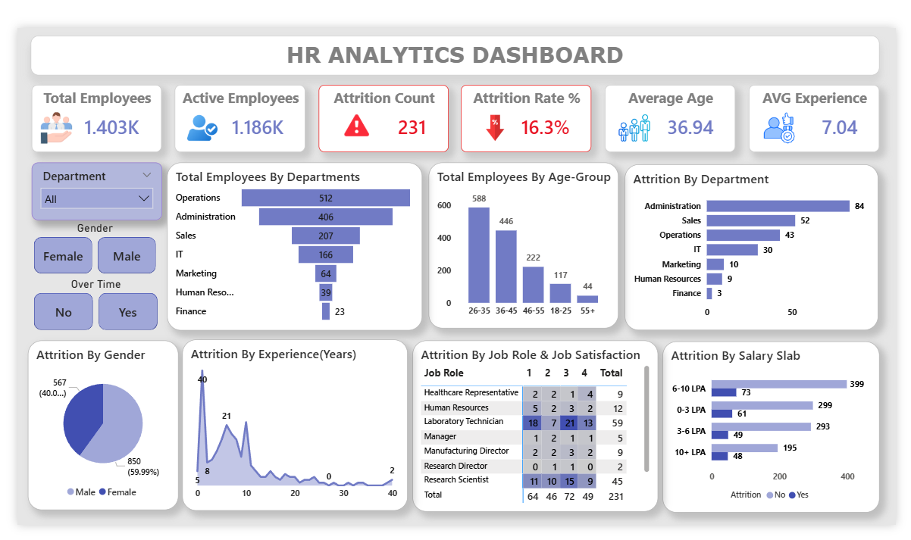

# HR-Analytics-Project

## Project Overview

End-to-End HR Analytics Dashboard built in Power BI to uncover the drivers of employee attrition. This project features full Power Query ETL (data cleaning, standardization, and custom column engineering)
This project is an End-to-End HR Analytics Dashboard built in Power BI to help businesses understand why employees leave.

## 📊 Dashboard Overview

## Objectives
- Analyze employee attrition trends
- Identify key factors driving employee turnover
- Monitor department-wise performance & workforce distribution
- Evaluate salary, experience, and job satisfaction impact on attrition
- Provide executive-level KPIs for decision-making

## Dataset Overview
- Total Records: 1,480 Employees
- Total Features: 37 Columns (Attributes)
- Demographics: Information like Age (ranging from 18 to 60), Gender, Marital Status, and Education.
- Employment Details: Professional data including Department (Sales, IT, Operations, etc.), Job Role, Job Level, and Total Years of Experience.
- Financial Metrics: Salary-related data like Monthly Income, Salary Slabs (0-3 LPA, 6-10 LPA, etc.), and Percent Salary Hike.
- Work-Life Factors: Critical insights like Overtime status, Business Travel frequency, and Distance from Home.
- Employee Sentiments: Ratings (1-4) for Job Satisfaction, Environment Satisfaction, and Work-Life Balance.

## Tech Stack
Power BI (Data Visualization & Dashboarding)
Power Query (Data Cleaning & Transformation)
DAX (Calculated Columns & Measures)

## Power BI workflow
### Data Preparation (Power Query)

To ensure high-quality analysis, the dataset was transformed using Power Query:
- Cleaned missing and inconsistent values
- Standardized column names for better readability
- Created new derived columns for enhanced analysis
- Ensured proper data types and formatting
- Structured data for efficient modeling

### Key Metrics (KPIs)
Total Employees
Active Employees
Attrition Count
Attrition Rate (%)
Average Age
Average Experience

### Visualization
- KPI Cards : Overall metrics like Total Employees, Attrition Rate
- Stacked Column Chart : Age Group vs Attrition (identifies high-risk age group)
- Bar Chart : Department-wise Attrition (highlights Sales & Admin)
- Donut Chart : Overtime vs Attrition (shows burnout impact)
- Clustered Column Chart : Experience vs Attrition (early-career trend)
- Bar Chart : Salary Slab vs Attrition
- Column Chart : Job Satisfaction vs Attrition
- Slicers : Interactive filtering by Department, Gender, Job Role

## Dashboard Insights
- Overtime is the strongest attrition driver:
Employees working overtime show significantly higher attrition.
- Department Impact :
Sales & Administration have the highest attrition,
These roles likely involve higher workload and overtime pressure
Finance & HR show low attrition .
- Experience Factor
Employees with 0–5 years experience are leaving the most.
- Age Group Trend
Highest attrition in 26–35 age group
This is the core working population, making attrition more critical
Likely driven by career growth expectations and workload stress.

## Business Insights :
Attrition is highest among young, early-career employees (0–5 years, age 26–35), especially in Sales and Administration departments, where overtime workload is high.
This indicates that burnout, compensation, and lack of growth opportunities are the primary drivers of employee turnover.

## Recommendations
- Reduce overtime load in high-pressure departments
- Focus retention strategies on early-career employees
- Improve work-life balance policies
- Provide clear growth paths for employees aged 26–35
- Monitor overtime as an early warning KPI
